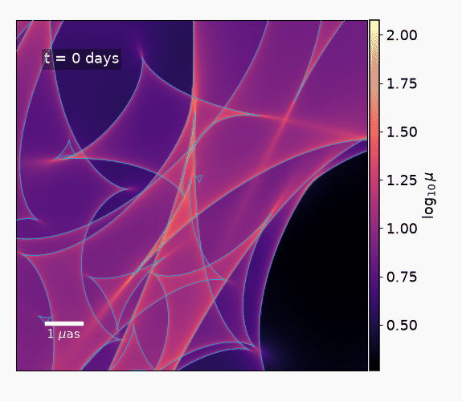

# microcaustics

`microcaustics` is a Python package for static and dynamic gravitational
microlensing simulations. Version 1.0.0 packages the validated numerical
methods used for the accompanying methods paper behind a documented public
interface.



The animation is a complete 147-frame output of the
[Q2237 light-curve tutorial](examples/notebooks/getting_started/01_q2237_production_light_curve_and_gif.ipynb).
It shows a ten-year, $10^7$-ray, $1024^2$ dynamic IPM calculation with the
caustic network overlaid. Its map normalization, colorbar, and indexed GIF
palette are fixed globally across all frames. This stellar realization was
selected to illustrate a dense caustic network and source-center crossings.

### Fast CUDA production path

`microcaustics` is designed for fast static and dynamic microlensing
calculations. Its main method is inverse polygon mapping. Rather than treating
each lens-plane sample as a single ray, it maps the corners of each lens-plane
cell into the source plane and distributes the cell's area among the source
pixels that it overlaps.

The production method first scouts the lens plane to identify cells whose
mapped rays can reach the requested source field. Cells that cannot contribute
are skipped. Nearby microlenses are evaluated exactly, while the combined
deflection from distant microlenses is represented by a local complex-Taylor
expansion. Higher-order sampling within each selected cell captures curvature
in the lens mapping and reduces finite-cell artifacts.

The selected cells are mapped and accumulated directly into the magnification
map by fused Triton kernels. This avoids storing large intermediate ray,
polygon, and triangle arrays. Temporal batches reuse the selected geometry and
numerical work across moving-star frames. Separate maps and light curves can
also be processed concurrently, and compatible simulations reuse already
compiled kernels.

Caustic extraction uses compact batched marching squares. Dedicated GPU
kernels calculate source-center crossing labels and full binary, distance, and
signed winding maps. All caustic and label products are optional, so map-only
and light-curve-only calculations do not pay for them.

The package also includes portable Torch implementations using the same
numerical definitions. These provide readable validation references and
support CPU, Apple, and non-Triton environments.

### Physical sources and lens systems

Microlens populations can be generated from built-in or user-defined mass
functions, including Salpeter populations. Users may control the mean mass,
mass range, smooth-matter fraction, stellar positions, bulk motion, and
velocity dispersion. Individual microlens masses, positions, and velocities
can also be supplied directly. The required circular stellar field is normally
determined automatically from the requested source region, light-loss
tolerance, and safety scale.

The package includes general-relativistic Novikov--Thorne accretion disks with
full Kerr ray tracing, relativistic redshifts, observer delays, lamp-post
heating, multiband disk images, and intrinsic source evolution. It can
calculate steady and microlensed transfer functions, continuum light curves,
redshift maps, and delay maps. These calculations can also be used without
lensing for general-relativistic disk modeling and continuum reverberation
mapping.

Supernovae, analytic profiles, pixelated sources, and custom evolving sources
use the same simulation interface. Intrinsic variability may be evaluated at a
finer cadence than the evolving magnification maps. Arbitrary wavelength bands
and user-defined observing schedules are supported. The package can generate
LSST-like observations using realistic survey cadences and band-dependent
photometric uncertainties.

Multi-image simulations apply one shared intrinsic source to any number of
macroimages. Each image may have its own macro lens parameters, microlens
population, stellar realization, trajectory, velocity model, and numerical
settings. Cosmological arrival-time delays can be supplied directly or
calculated from a user-defined strong-lens model. The resulting products
include coherent multi-image light curves, LSST-like sampled observations,
independent magnification maps, microlensed transfer functions,
caustic-crossing labels, and resolved strong-lens images.

## Installation

Create a Python 3.10+ environment, then install PyTorch **before** installing
`microcaustics`. Use the live
[PyTorch installation selector](https://pytorch.org/get-started/locally/) to
choose the correct command for the operating system and compute platform. In
particular, select a CUDA build rather than the CPU build for an NVIDIA GPU.
The exact CUDA wheel command changes between PyTorch releases.

Verify the PyTorch installation before continuing.

```bash
python -c "import torch; print('torch', torch.__version__); print('CUDA', torch.cuda.is_available(), torch.version.cuda); print(torch.cuda.get_device_name(0) if torch.cuda.is_available() else 'CPU/MPS')"
```

Install the tagged release directly from GitHub after PyTorch is available.

```bash
python -m pip install "microcaustics @ git+https://github.com/JFagin/microcaustics.git@v1.0.0"
```

Clone the repository when you want to run the notebooks, edit the source, or
contribute changes. A complete development installation is available from the
repository root.

```bash
python -m pip install -e ".[dev,docs,notebooks,test,validation]"
```

For an editable installation without development tools, use
`python -m pip install -e .`. Plotting, notebooks, astronomy dependencies, and
external validation packages remain optional extras. The standalone scripts
are indexed in [`examples/README.md`](examples/README.md).

The numerical core supports Python 3.10 and newer.

### Triton acceleration

The production fused IPM path requires an NVIDIA CUDA device, float32, and an
importable Triton package. This path is significantly faster than compiled PyTorch.

- **Linux.** Upstream Triton officially supports Linux. Install PyTorch first.
  If `import triton` is still unavailable, follow the
  [official Triton installation and compatibility guidance](https://github.com/triton-lang/triton#compatibility).
  Keep the Triton minor version compatible with the installed PyTorch release.
- **Native Windows.** Upstream Triton does not officially support Windows.
  Use the community-maintained
  [`triton-windows` distribution](https://github.com/triton-lang/triton-windows)
  and follow its current PyTorch/Triton compatibility table. For example, only
  when that table assigns Triton 3.7 to the installed PyTorch release.

  ```powershell
  python -m pip uninstall -y triton
  python -m pip install -U "triton-windows>=3.7,<3.8"
  ```

  Do not blindly reuse that example for a different PyTorch minor release.
  Current wheels bundle the minimal CUDA toolchain, but require a current
  NVIDIA driver and the Microsoft Visual C++ Redistributable documented by the
  project.
- **Windows through WSL2.** Install
  [WSL](https://learn.microsoft.com/windows/wsl/install), enable NVIDIA's
  [CUDA support for WSL](https://docs.nvidia.com/cuda/wsl-user-guide/index.html),
  and then follow the Linux path above. This stays within upstream Triton's
  supported operating system.
- **macOS or CPU.** Triton is not used. The package selects its portable
  eager/compiled PyTorch implementation. Apple MPS is supported where PyTorch
  supports the requested operations.

Check the detected runtime.

```bash
microcaustics doctor
```

For a timing or validation run that must not silently fall back to PyTorch,
request `RuntimeConfig(device="cuda", backend="triton", dtype="float32",
strict_backend=True)`. The default CUDA memory ceiling is 95 percent, and
lossless OOM recovery reduces chunks or splits batches when necessary. See the
[portability and troubleshooting guide](docs/portability_and_troubleshooting.md)
for cache, compiler, first-call timing, and out-of-memory guidance.
Potentially slow compilation events are reported by default; set
`warn_on_compile=False` in `RuntimeConfig` to silence them.

## Tutorial notebooks

The notebooks are the recommended introduction to the package because they
show complete scientific workflows, physical coordinate conventions, and
accelerator timing. Install the notebook dependencies and launch the
collection with the following commands.

```bash
python -m pip install -e ".[notebooks,science,macro]"
jupyter lab examples/notebooks
```

The complete collection uses the `science` dependencies for cosmology and
numerical reference calculations. It also uses the `macro` dependencies for
the strong-lens rendering tutorials. The `caustics` dependency in `macro`
requires Python 3.11 or newer. The remaining package and notebooks support
Python 3.10.

Start with
[Getting started with maps and light curves](examples/notebooks/getting_started/01_q2237_production_light_curve_and_gif.ipynb).
It generates a ten-year dynamic magnification sequence, finite-source light
curves with and without intrinsic variability, source-center caustic labels,
and the animation shown above. The calculation uses the documented production
IPM and far-field settings rather than a simplified plotting surrogate.

The complete notebook guide is organized into five tracks.

| Track | Notebooks |
|---|---|
| Getting started | [Static maps and numerical methods](examples/notebooks/getting_started/00_static_maps_and_numerical_methods.ipynb), [Q2237 production light curves](examples/notebooks/getting_started/01_q2237_production_light_curve_and_gif.ipynb), and [dynamic maps and light curves](examples/notebooks/getting_started/02_dynamic_maps_and_light_curves.ipynb) |
| Methods | [Stellar populations and mass functions](examples/notebooks/methods/00_stellar_populations_and_mass_functions.ipynb), [far-field approximation](examples/notebooks/methods/01_far_field_approximation.ipynb), and [caustics and labels](examples/notebooks/methods/02_caustics_and_labels.ipynb) |
| Source models | [Relativistic disks and reverberation](examples/notebooks/source_models/00_relativistic_disks_and_reverberation.ipynb), [expanding supernovae](examples/notebooks/source_models/01_expanding_supernovae.ipynb), [custom sources and variability](examples/notebooks/source_models/02_custom_sources_and_variability.ipynb), and [spectral microlensing](examples/notebooks/source_models/03_spectral_microlensing.ipynb) |
| Workflows | [Multi-image light curves and observations](examples/notebooks/workflows/00_multi_image_light_curves_and_observations.ipynb), [realistic strong-lens images](examples/notebooks/workflows/01_realistic_strong_lens_image.ipynb), [end-to-end lensed quasars](examples/notebooks/workflows/02_end_to_end_lensed_quasar.ipynb), [streaming and export](examples/notebooks/workflows/03_streaming_and_exporting_results.ipynb), and [simulation datasets](examples/notebooks/workflows/04_simulation_datasets.ipynb) |
| Validation | [Weisenbach IPM](examples/notebooks/validation/00_weisenbach_ipm_visual_validation.ipynb), [SIM5 GR](examples/notebooks/validation/01_sim5_gr_visual_validation.ipynb), [accuracy and performance](examples/notebooks/validation/02_accuracy_and_performance.ipynb), and [analytic single-point lens](examples/notebooks/validation/03_single_point_lens_validation.ipynb) |

The validation notebooks can use independently generated Weisenbach and SIM5
products when those external codes are available. The remaining notebooks run
only with the public `microcaustics` interface and their documented optional
dependencies.

## Magnification maps without a source model

A magnification map depends on the lenses and the source-plane geometry, not
on a disk or brightness profile. Specify the redshifts, lens parameters, and
stellar population, then choose the map width and pixel count. The package
derives the circular stellar field, number of stars, Einstein radii, and
lens-plane bounds automatically.

### 1. Generate a static map

```python
import microcaustics as mc
import microcaustics.plotting as mcp

map_macro = mc.MacroLens(
    convergence=0.391,          # total convergence, kappa
    shear=0.391,                # shear amplitude, gamma
    shear_angle_deg=141.73,     # shear position angle in degrees
    smooth_matter_fraction=0.0, # fraction of kappa in smooth matter
)
map_system = mc.MicrolensingSystem(
    lens_redshift=0.0395,
    source_redshift=1.695,
    H0=70.0, Om0=0.3,           # flat cosmology, H0 in km s^-1 Mpc^-1
    macro=map_macro,
    stellar_population=mc.StellarPopulation.salpeter(
        mean_mass_solar=0.3,
        mass_ratio=100.0,       # maximum / minimum stellar mass
    ),
    integration_domain="scout", # "scout", "full", or "rectangle"
    light_loss=0.01,             # stellar-aperture truncation tolerance
    safety_scale=1.5,            # enlarge the derived circular star field
    seed=0,                     # change for another realization, omit for random draws
)

static_map = map_system.magnification_map(
    map_width_uas=10.0,  # full width, 10 x 10 microarcseconds
    map_pixels=1024,     # output pixels per axis
    rays=10_000_000,     # lens-plane sampling budget, increase for accuracy
)
print(static_map.values.shape)  # [1024, 1024], dimensionless magnification

figure, ax = mcp.plot_magnification_map(
    static_map, log10=True, scale_bar_uas=1.0, show_axes=False,
)
```

This returns an unconvolved map using IPM with the Taylor far-field
approximation. Use `method="irs"` in the map call for Cartesian inverse ray
shooting. For direct numerical control, pass either
`mc.IRSConfig(rays=10_000_000, sampling="cartesian")` or
`mc.IRSConfig(rays=10_000_000, sampling="random", seed=0)` as `method`.
Cartesian sampling is deterministic and remains the default. Random sampling
uses the same ray coordinates at every epoch so sampling noise is not mistaken
for physical variability.
The integration domain changes which lens-plane cells are sampled, not the
underlying circular stellar population. More pixels alone do not improve
sampling accuracy, so adjust `rays` as well when resolving finer structure.

### 2. Add motion and generate dynamic maps

Add a velocity model to the population and request a sequence of observer-frame
times. This Q2237 image-B-like example includes stellar dispersion, lens and
source peculiar velocities, and the sky-projected CMB motion. No luminous
source model is required.

```python
moving_system = mc.MicrolensingSystem(
    lens_redshift=0.0395,
    source_redshift=1.695,
    H0=70.0, Om0=0.3,
    macro=map_macro,  # same local lens parameters as above
    stellar_population=mc.StellarPopulation.salpeter(
        mean_mass_solar=0.3, mass_ratio=100.0,
        kinematics=mc.SkyProjectedKinematics(
            ra_deg=340.126125, dec_deg=3.358611,  # sky position in degrees
            stellar_dispersion_km_s=170.0,       # 1D proper stellar dispersion
            peculiar_velocity_dispersion_km_s=235.0, # lens/source velocity scale
            include_cmb_dipole=True,             # observer motion projected on sky
        ),
    ),
    light_loss=0.01,
    safety_scale=1.5,
    seed=0,  # also controls the independent velocity draws
)

map_times_days = list(range(0, 3651, 25))  # 147 epochs spanning ten years
maps = moving_system.dynamic_maps(
    map_times_days,
    map_width_uas=10.0,  # fixed source-plane field throughout the sequence
    map_pixels=1024,
    rays=10_000_000,
    schedule=mc.production_dynamic_config(
        temporal_batch_size=49, # frames computed together, lower for less VRAM
        scout_refresh_frames=10, # refresh interval in map epochs, 1 disables reuse
    ),
)
for frame in maps:
    print(frame.time_days, frame.values.shape)
    # Plot, save, or consume frame.values without retaining the whole sequence.
```

The iterator delivers individual maps from internally computed temporal
batches. With CUDA and Triton available, the defaults use the fused production
IPM path with `k=2`, `r=2`, `v=4`, 8-by-8 Taylor nodes per far-field cell,
endpoint-union scout reuse, and the initial scout normalization correction.
Every epoch gets its own far-field coefficients. The explicit `schedule`
above shows the defaults and can be omitted.

The package converts velocities to angular motion, includes cosmological time
dilation, and sizes the stellar aperture for the requested duration. Compatible
calls reuse compiled kernels after the first call. Consuming the iterator
does not recompile for every frame. CPU and non-Triton environments use the
portable implementation.

### 3. Supply individual stars instead

Use `stars` instead of `stellar_population` when positions and masses are
known. Positions are in microarcseconds and masses are in solar masses.
The package derives their Einstein radii from the redshifts.

```python
import torch

stars = mc.PointMassField(
    x_uas=torch.tensor([-1.0, 1.0]),
    y_uas=torch.tensor([0.0, 0.0]),
    mass_solar=torch.tensor([0.09, 0.04]),
)
two_star_system = mc.MicrolensingSystem(
    lens_redshift=0.5,
    source_redshift=2.0,
    macro=mc.MacroLens(convergence=0.0, shear=0.1),
    stars=stars,
)
two_star_map = two_star_system.magnification_map(
    map_width_uas=10.0,  # square source-plane width
    map_pixels=1024,     # output pixels per axis
    rays=10_000_000,
)
print(two_star_map.values.shape)  # [1024, 1024], dimensionless magnification
```

The centered lens plane is inferred automatically. Advanced calculations can
choose a centered square or rectangle with `lens_plane_uas`, or use an
explicit `PlaneRegion` for an off-center field. Use an explicit `PlaneGrid`
only when the source map itself must be rectangular or off-center. See the
[static-map tutorial](examples/notebooks/getting_started/00_static_maps_and_numerical_methods.ipynb)
for these controls and conversions to mean-microlens Einstein units.

## Physical sources and light curves

This example follows the first tutorial notebook. It defines one Q2237 image
B-like physical system, generates an independent magnification map, and then
generates a ten-year light curve with source-center caustic labels. The
requested light-curve time axis automatically expands the stellar aperture
and map geometry for the full trajectory. The package derives the source grid, circular stellar field,
number of stars, Einstein radii, stellar velocities, and lens-plane bounds.

### 1. Define the lens, source, and stellar population

```python
import torch
import microcaustics as mc
import microcaustics.plotting as mcp

macro = mc.MacroLens(
    convergence=0.391,          # total convergence, kappa
    shear=0.391,                # shear amplitude, gamma
    shear_angle_deg=141.73,     # shear position angle in degrees
    smooth_matter_fraction=0.0, # s, fraction of kappa in smooth matter
)

driver = mc.broken_power_law_driving_signal(
    cadence_days=0.1,            # driver interpolation grid, not the map cadence
    break_timescale_days=200.0,  # PSD break timescale in days
    alpha_L=1.0,                # positive low-frequency PSD slope
    alpha_R=3.0,                # positive high-frequency PSD slope
    standard_deviation=0.10,    # amplitude standard deviation, mean defaults to one
)

source = mc.KerrDiskModel(
    black_hole_mass_solar=10.0**9.08,
    eddington_ratio=0.34,
    bands_angstrom={"u": 3671, "g": 4827, "r": 6223,
                     "i": 7546, "z": 8691, "y": 9712},
    spin=0.74,
    viscous_flux_profile="novikov-thorne",  # default; "shakura-sunyaev" is built in
    inclination_deg=10.0,
    position_angle_deg=0.0,
    lamp_fraction=0.1,
    corona_height_above_isco_rg=20.0,
    driving_signal=driver,          # optional, inherits the system's variability seed
    source_grid_shape=1024,          # disk/map pixels per axis, e.g. 512 or 1024
    enclosed_flux_fraction=0.999,
    source_margin=1.05,
)

kinematics = mc.SkyProjectedKinematics(
    ra_deg=340.126125,
    dec_deg=3.358611,
    peculiar_velocity_dispersion_km_s=235.0,
    stellar_dispersion_km_s=170.0,
    include_cmb_dipole=True,        # project observer motion at this sky position
)
population = mc.StellarPopulation.salpeter(
    mean_mass_solar=0.3,
    mass_ratio=100,
    kinematics=kinematics,
)

system = mc.MicrolensingSystem(
    lens_redshift=0.0395,
    source_redshift=1.695,
    H0=70.0,                         # km s^-1 Mpc^-1
    Om0=0.3,                         # present-day matter density
    macro=macro,
    source=source,
    stellar_population=population,
    integration_domain="scout",     # "scout", "full", or "rectangle"
    light_loss=0.01,                 # stellar-aperture truncation tolerance
    safety_scale=1.5,                # expand the derived circular star field
    stellar_motion_sigma_margin=5.0, # motion allowance over the full duration
    seed=0,
    caustic_grid_shape=8192,         # detA pixels per axis for labels
)
```

The stellar convergence is derived as $\kappa_\star=(1-s)\kappa$, where
`s = smooth_matter_fraction`. Here `s=0` puts all the convergence in stars.
For a population with a known stellar convergence, set
`smooth_matter_fraction=1 - kappa_star / kappa` rather than specifying both
independently.

The system evaluates a flat matter-plus-cosmological-constant geometry in
Torch float32. Supply an explicit `LensingDistances` object for a different
expansion history. The
stellar-realization and peculiar-velocity seeds are separate, so both random
processes remain independently reproducible.

A single integer seed is enough for a reproducible calculation. The package
derives stable independent streams for stars, sky kinematics, source
variability, observations, and each macroimage. A mapping can override only
the desired components, for example
`seed={"base": 0, "stars": 1, "kinematics": 2}`. An explicit seed on a
driving signal or `SkyProjectedKinematics` overrides the inherited stream.

Most examples use `seed=0`. Choose a different integer for a new realization.
Omitting the seed in your own calculation still draws fresh random inputs.

Before allocating stars or compiling a kernel, inspect the derived geometry
and resource scale with `system.summary(duration_days=3650)`. The returned
dictionary can also be validated programmatically, and the call performs no
simulation.

`source_grid_shape` is the number of source pixels per axis, not a physical source
size. Quasar models derive their angular field from the black-hole, accretion,
wavelength, inclination, redshift, and enclosed-flux settings.
Expanding-supernova models derive it from the largest photospheric radius over
the requested evolution.
When a source trajectory is supplied to `MicrolensingSystem`, its duration is
also included automatically so the derived map field covers the complete
path. An explicit `PlaneGrid` is only needed for an advanced rectangular or
off-center field. Centered source-independent maps use plain width and pixel
arguments instead.

### 2. Generate and plot one magnification map

```python
magnification_map = system.magnification_map(
    time_days=0.0,
    rays=10_000_000,  # increase for finer lens-plane sampling
)
print(magnification_map.values.shape)  # [1024, 1024], dimensionless magnification

figure, ax = mcp.plot_magnification_map(
    magnification_map,
    log10=True,
    scale_bar_uas=1.0,
    show_axes=False,
)
```

For a static map, the two main numerical controls are `rays` and `source_grid_shape`.
`rays` sets the lens-plane sampling budget, for example
`system.magnification_map(rays=5_000_000)`. `source_grid_shape` in the source
definition sets the disk and magnification-map resolution. Change it to
`512` for a smaller pixel grid or keep `1024` for the examples shown here.
Neither requires choosing the physical source size manually.

More output pixels resolve finer structure but do not replace adequate ray
sampling. For an initial preview, lower either control, then check convergence
before using the result scientifically. Refinement settings are advanced
controls described below. Use `method="irs"` for inverse ray shooting, or set
`integration_domain` on the system to `"scout"`, `"full"`, or `"rectangle"`.

### 3. Generate a production light curve with labels

The shortest call uses the complete validated production path. This means
`N=10^7`, `k=2`, true refinement `r=2`, virtual refinement `v=4`, the
local-exact complex-Taylor far field, temporal batching, conservative
endpoint-union scout reuse, and aligned source-center labels.
The maps use the `source_grid_shape` set on the source above, while `rays`
can be changed on each light-curve call. For dynamic light curves, temporal
batch size and the scout refresh interval are also important controls.

```python
microlensing_only = system.light_curve(
    duration_days=3650,
    map_cadence_days=25,          # 147 map epochs, including day zero
    rays=10_000_000,              # increase for accuracy or lower for previews
    temporal_batch_size=30,      # map epochs per batch, lower for less VRAM
    scout_refresh_frames=10,     # refresh interval in map epochs, 1 scouts every epoch
    include_labels=True,        # source-center labels, not full label maps
    apply_driving_signal=False, # constant mean heating, no driving fluctuations
    keep_maps_at_days=(0.0,),     # retain only this map, not the full sequence
)

map_at_day_zero = microlensing_only.maps[0]
print(microlensing_only.map_times_days)                # [0.0], retained map epochs
print(microlensing_only.magnitude.shape)               # [147, 6], apparent AB magnitudes
print(microlensing_only.flux.shape)                    # [147, 6], original Jy fluxes
print(microlensing_only.labels.crossing_labels)        # [147], aligned binary labels
print(microlensing_only.labels.crossing_events)        # [147], boolean label transitions
print(microlensing_only.labels.center_distances_uas)   # [147], distances in microarcseconds
print(map_at_day_zero.values.shape)            # [1024, 1024], magnification

figure, ax = mcp.plot_light_curve(
    microlensing_only,
    bands=("i",),
    magnitude=True,
    show_unlensed=True,
    title="Q2237 image B-like light curve",
)
```

`temporal_batch_size` controls how many map epochs are processed together.
It affects throughput and memory rather than the requested sampling accuracy.
A short sequence can use a smaller batch to avoid unnecessary padding.
Larger batches are not always faster, even when they divide the sequence
length exactly. The example uses 30 for maps with labels, while the default
light-curve-only schedule uses 49.

`scout_refresh_frames` controls how long the selected lens-plane geometry is
reused between scout refreshes. It counts map epochs, not daily source samples.
Keep 10 as a starting point or lower it for more conservative scouting.
Increasing it is an approximation that should be validated for the map cadence
and lens/source motion, not chosen just to divide the batch size.

Intrinsic variability can be evaluated daily while the dynamic maps remain
on the coarser 25-day cadence. Turn on the driver already supplied to the disk.

```python
combined = system.light_curve(
    duration_days=3650,
    map_cadence_days=25,         # microlensing map cadence
    source_cadence_days=1,       # intrinsic source cadence
    rays=10_000_000,             # same map accuracy control as above
    temporal_batch_size=30,
    scout_refresh_frames=10,
    include_labels=True,
    apply_driving_signal=True,
)
print(combined.magnitude.shape)                # [3651, 6], daily AB magnitudes
print(combined.labels.crossing_labels.shape)   # [147], labels stay at the map cadence
print(combined.labels.times_days.shape)        # [147], separate label epochs
```

The driver is generated once on a fixed grid. Defaults cover day -1000 through
day 7300, with fivefold FFT padding followed by cropping to reduce boundary
effects. Shorter light-curve requests reuse the same driver samples. Set
`max_duration_days`, `history_days`, or `padding_factor` on the driver to change
these choices. The 1000-day history is not sufficient for every source or arrival
delay. Out-of-range queries raise an error rather than hold an endpoint.
Changing the generation grid can change the entire realization even with the
same seed. A driver-specific `seed` overrides the inherited system seed.

Omitting `apply_driving_signal` uses the supplied driver automatically. Setting
it to false holds the driver at its mean without removing lamp heating or
freezing other source evolution, such as supernova expansion. Custom signals
use unit baseline unless their metadata supplies `mean_amplitude`.

To construct a source with no driving signal, omit `driving_signal` from the
disk constructor. Light curves then work without an extra switch. Explicitly
requesting `apply_driving_signal=True` for a source without a driver raises an
error. Supernovae evolve through their own source model and need no driver.
For a custom source, use `ModulatedSource` only when you intend additional
multiplicative brightness modulation. Replacing a source replaces its driver
too, without inheriting the previous source's driver.

Only requested maps are retained. A request that is not an evaluated map epoch
produces a warning and is omitted, without interpolation or extra ray tracing.
Inspect `result.map_times_days` before indexing `result.maps`.

For advanced use, the same calculation can expose refinement, additional scout
controls, and far-field settings explicitly. You can leave these at their
defaults when adjusting ray count, pixel resolution, temporal batch size, and
the scout refresh interval.

```python
far_field = mc.FarFieldApproxConfig(
    enabled=True,
    cells_per_axis=16,           # far-field spatial partition
    nodes_per_cell_axis=8,       # evaluation nodes per partition cell
    exact_radius_cells=1.0,      # larger values trace more nearby stars exactly
    taylor_order=4,              # higher values improve the far-star expansion
    center_translation_order=10, # accuracy when translating cell expansions
)

method = mc.production_ipm_config(
    rays=10_000_000,            # N
    scout_ratio=2,               # k, lower values use a denser scout
    refinement=2,                # r, true lens-equation refinement
    virtual_refinement=4,        # v, interpolated polygon refinement
    scout_halo_pixels=0.0,       # optional source-pixel coverage halo
    scout_dilation_cells=1,      # conservative neighboring-cell expansion
    dual_scout_scalar_correction=True,  # one-time k=1 to k=2 correction
    cell_chunk_size=524_288,     # lower this to reduce peak memory
    far_field_approx=far_field,
)

schedule = mc.production_dynamic_config(
    temporal_batch_size=30,      # optimized for the combined LC + label path
    light_curve_batch_size=None,  # optional sources sharing this map sequence
    fused_temporal_ipm=True,     # disable only for implementation validation
    scout_refresh_frames=10,     # lower for more frequent scout refreshes
)

labels = mc.CausticConfig(
    far_field_approx=far_field,
    # Labels inherit the shared 30-frame map batch. LC-only calls use the
    # 49-frame production preset because they omit detA and marching squares.
    discovery_downsample_ratio=16,  # 8192-pixel detA -> 512-pixel discovery
    discovery_near_zero_quantile=0.05,  # retain low-|detA| coarse cells
    discovery_dilation_cells=2,     # pad coarse critical-curve candidates
    anchor_count=9,              # more points add alignment redundancy
    gauge_count=9,
    minimum_determinant_sign_pixels=4,  # remove unresolved sign islands
    minimum_alignment_gauges=3, # minimum trusted temporal alignment set
)

explicit_result = system.light_curve(
    duration_days=3650,
    map_cadence_days=25,
    source_cadence_days=1,
    method=method,
    schedule=schedule,
    caustics=labels,
    include_labels=True,
    keep_maps_at_days=(0.0,),
)
```

The short labeled call uses a shared 30-frame map and label batch. An LC-only
call uses the 49-frame production preset. The expanded example repeats the
settings intentionally so every effective value is visible. Lower-level label
query and Triton chunk controls remain available in `CausticConfig` for
unusual workloads.

Only the requested day-zero map is retained. The other full-resolution maps
are streamed through the finite-source photometry and label calculation rather
than stored as a large cube. The first tutorial extends this same workflow to
daily intrinsic variability, a 25-day microlensing cadence, and a fixed-scale
GIF of all 147 maps.

## Warmup, reuse, and profiling

Compiled Torch and Triton kernels are cached by compatible execution shape.
Reusing one `MicrolensingSystem` also reuses its seeded stellar realization.
An explicit warmup can separate first-call compilation from production work.

```python
# Use a representative temporal batch so the production batch shape is warm.
system.warmup_light_curve(include_labels=True, temporal_batch_size=30)

# Subsequent compatible calls reuse the realization and warmed kernels.
next_result = system.light_curve(
    duration_days=3650,
    map_cadence_days=25,
    rays=10_000_000,  # keep the numerical settings fixed to reuse warmed kernels
    temporal_batch_size=30,
    include_labels=True,
)
```

`system.light_curves(...)` batches multiple sources or trajectories through a
shared map sequence. This is what `light_curve_batch_size` controls.
`batched_system_maps(...)` batches unrelated static systems without sharing
their stars. `batched_system_light_curves(...)` accepts any mixture of single,
double, quad, or other multi-image systems. It flattens their independent
macroimage calculations for execution and restores the original system
grouping afterward. Compatible production Triton jobs also share one
ownership-tagged cross-system map and label queue. Each realization keeps its
own scout cells; incompatible images automatically retain private-stream
execution. All three interfaces reuse compatible compiled kernels.

Independent stellar realizations of the same macroimage can be generated
together. Each seed produces a new star field. Compatible Triton or
compiled-Torch kernels are reused.

```python
systems = [system.with_seed(seed) for seed in range(8)]
maps = mc.batched_system_maps(
    systems,
    batch_size=8,  # automatically reduced if necessary to avoid an OOM
)
```

The same systems can produce independent dynamic light curves. Each retains
its own stars, source, trajectory, variability, maps, and labels.

```python
batch = mc.batched_system_light_curves(
    systems,
    duration_days=3650,
    map_cadence_days=25,
    source_cadence_days=1,
    rays=10_000_000,
    temporal_batch_size=30,
    scout_refresh_frames=10,
    curves_per_batch=3,  # individual macroimage curves, not systems
    include_labels=True,
)
curves = batch.light_curves
print(curves[0].magnitude.shape, batch.executed_batch_sizes)
```

Large datasets can be streamed through a bounded background writer. A directory
produces flat per-image files plus a manifest; a `.npz` path produces one
combined archive. Neither mode retains all curves in accelerator memory.

```python
saved = mc.batched_system_light_curves(
    systems,
    duration_days=3650,
    map_cadence_days=25,
    source_cadence_days=1,
    curves_per_batch=3,
    output_path="training_curves.npz",  # or a directory
)
first_system = saved.load_system(0)
```

Flat-directory jobs can pass `resume=True` after interruption; systems whose
expected image files are complete are reused. `overwrite=True` starts a fresh
logical output and replaces matching files. Combined archives are finalized
atomically and do not support partial resume. Resume assumes the same ordered
inputs and numerical configuration as the original call.

Pass `profile=True` to collect batch wall time and `batch.seconds_per_curve`.
They are unavailable by default, without timing-only device synchronization.

CUDA memory exhaustion reduces only the active concurrency and retries the
same numerical calculation. The best concurrency depends on the star count,
map geometry, labels, and GPU. It can be measured explicitly with
`mc.tune_system_light_curve_batch(..., candidates=(1, 2, 3, 4))`. Tuning is
not run silently during production.

Different convergence, shear, redshift, stellar, trajectory, variability, and
disk parameter values also reuse an existing compatible kernel specialization.
They do not need to share one stellar field and may be evaluated sequentially
or through the applicable batching interface. Keep the numerical shapes and
configuration fixed for maximum throughput. Changing source resolution, band
count, temporal batch size, dtype, backend, or the IPM and far-field shape
controls can require one new compiled specialization. A substantially
different stellar count can also produce a new compiled-Torch shape variant.
This compilation is cached and reused by later compatible realizations.

Timing collection is off by default and does not add timing-only GPU
synchronization. See the [timing guide](docs/timing.md) for optional profiling
and first-call versus warmed performance measurements.

`integration_domain="scout"` is the fast production path. It evaluates only
cells that can map into the source field. `"full"` evaluates every cell in the
square bounding the complete circular stellar field. `"rectangle"` evaluates
the conventional light-loss rectangle while retaining the same complete
circular star population. The latter can use a separate
`rectangle_light_loss=` value on `MicrolensingSystem`.

For dynamic scout calculations, `scout_refresh_frames` is the reuse interval.
Endpoint union retains the cells selected at both ends of each interval, which
protects motion between refreshes. The far-field Taylor coefficients themselves
are rebuilt at every epoch in the validated production mode. There is no hidden
temporal coefficient reuse. Disable the far-field approximation with
`FarFieldApproxConfig(enabled=False)` for a direct point-mass reference calculation.

The main accuracy and throughput controls in the example are listed below.

| Control | Meaning |
|---|---|
| `rays` | Requested base lens-plane cell budget, $N$ |
| `source_grid_shape` | Disk and magnification-map pixels per axis, set on the source model |
| `map_pixels` | Magnification-map pixels per axis when no source model is supplied |
| `integration_domain` | `"scout"`, `"full"`, or `"rectangle"` integration region |
| `scout_ratio` | Scout coarsening factor, $k$, used only by the scout domain |
| `refinement` | True lens-equation refinement, $r$ |
| `virtual_refinement` | Interpolated polygon refinement, $v$ |
| `FarFieldApproxConfig` | Local partition, exact-neighbor radius, Taylor order, and node resolution |
| `scout_refresh_frames` | Number of dynamic epochs sharing an endpoint-union scout selection |
| `temporal_batch_size` | Number of consecutive maps processed by one fused temporal batch |
| `light_curve_batch_size` | Number of sources or trajectories sampled from one shared map sequence |
| `curves_per_batch` | Number of independent macroimage light curves run concurrently on one GPU |
| `cell_chunk_size` | Maximum spatial work chunk before automatic memory backoff |
| `caustic_grid_shape` | Resolution of determinant, critical-curve, and source-center-label products |
| `discovery_downsample_ratio` | Coarsening of the critical-curve discovery grid before sparse full-resolution determinant evaluation |

The production far-field configuration uses a `16 x 16` partition to decide
which stars are evaluated exactly. Each partition cell contains an `8 x 8`
Taylor evaluation lattice. The latter is the grid shown in the far-field
schematic and should not be confused with the older interpolation method.

The production constructors are presets rather than separate restricted code
paths. Every value above may be overridden, and the same controls work with
independent-map batches, multi-image calculations, custom sources, and directly
supplied stellar fields. Automatic tuning and lossless CUDA out-of-memory
backoff remain available when explicit batch or chunk values are omitted.

The default dynamic method is the validated `N=10^7`, `k=2`, `r=2`, `v=4`
scout IPM with the one-time `k=1` normalization correction. The stellar field
is always the complete circular field. `integration_domain="full"` evaluates
all cells in its bounding square, while `"rectangle"` changes only the launch
region and never removes stars. Directly supplied `PointMassField` objects and
explicit source or lens grids remain supported for controlled experiments.

Physical models such as `KerrDiskModel`, `ThinDiskModel`, and `GaussianModel`
choose their own pixel grids. Existing pixelated, callable, expanding-supernova, and custom
sources can still be supplied directly. A source is optional when only a
magnification map is required.

Custom `CallableSource` models accept `source_grid_shape`, `field_of_view_uas`,
and `bands_angstrom` directly. `StaticSource` accepts the same angular extent
and bands and infers the pixel shape from its image. The system handles the
distance conversion, so no separate geometry object is needed. See the
[custom-source guide](docs/sources.md) for physical brightness units and examples.

Standalone disks also need no lens setup. For example,
`source.pixelate(source_redshift=1.695, H0=70, Om0=0.3)` returns the resolved
disk for images and continuum reverberation. Supernova models inherit the
system redshift and distance when passed directly to a system.

Point lenses may be supplied directly or sampled from any object implementing
the `MassFunction` protocol. Population builders expose their lens region and
report the realized compact convergence. They do not apply hidden light-loss
rectangles or safety factors. See
[`docs/lens_populations.md`](docs/lens_populations.md).

High-level operations choose the production scout automatically. An
independent static map uses `k=1`, while a moving sequence uses `k=2` plus the
one-time `k=1` normalization repair. Call `production_ipm_config()` only when
an advanced experiment needs an explicit numerical configuration.
Both use `N=10_000_000, r=2, v=4` by default. These are not fixed constants. The implementation
supports arbitrary sensible ray budgets and scout ratios, as well as
`virtual_refinement >= refinement >= 1`. CUDA float32 automatically uses the
direct-cell Triton rasterizer for `v <= 16`. CPU, Apple, float64, and larger
`v` use the same numerical method through the exact portable rasterizer. See
[`docs/ipm.md`](docs/ipm.md) for the meaning and tradeoffs of `N`, `k`, `r`,
and `v`.
The validated scout uses `scout_halo_pixels=0` and
`scout_dilation_cells=1`. The former expands the source aperture, whereas the
latter retains a one-cell support ring in the lens plane. Both can be changed
explicitly for convergence or safety studies.

Compatible unrelated static star fields can be evaluated together with
`batched_magnification_maps`. This is genuine independent-map batching. Each
request has its own stars, far-field state, scout mask, result, and metadata.
The [stellar-population notebook](examples/notebooks/methods/00_stellar_populations_and_mass_functions.ipynb)
demonstrates the interface across several stellar mass functions.
The dedicated [far-field notebook](examples/notebooks/methods/01_far_field_approximation.ipynb)
explains every `FarFieldApproxConfig` control, shows the production cell/node geometry,
and demonstrates direct-raytrace accuracy and runtime validation before a
setting is changed.

Dynamic calculations use `DynamicConfig` for static-map reuse, temporal and
multi-source batching, lossless CUDA OOM backoff, and optional endpoint-union
scout reuse.
See [`docs/dynamic.md`](docs/dynamic.md). Approximate reuse is always recorded
in map metadata rather than being silently enabled.

Portable exact deflection/Jacobian blocks, Taylor far-field queries, and IRS
deposition have real cached `torch.compile` implementations. Result metadata
separates the requested backend from what actually executed. The portable IPM
polygon clipper is deliberately retained as an exact Python reference and is
reported as `torch-compile-partial`. CUDA float32 uses the fully fused Triton
IPM rasterizer.

Temporal batches, IPM cell chunks, IRS ray chunks, and caustic Jacobian chunks
can optionally be selected by warmed, memory-bounded steady-state tuning.
Tuning is disabled by default and never changes physical or resolution
parameters. See [`docs/tuning.md`](docs/tuning.md) and
[`examples/automatic_tuning.py`](examples/automatic_tuning.py).

Runnable scripts live in [`examples`](examples). Reusable plotting helpers and
additional notebook guidance are described in
[`docs/plotting.md`](docs/plotting.md). The core numerical package does not
import Matplotlib or Jupyter.

The final tutorials also build labeled machine-learning training sets for a
fixed Q2237 image and for prior-sampled lens/disk parameters. Their companion
scripts use ordinary Python multiprocessing. No distributed launcher is
required, and each GPU retains one persistent worker and compiler cache.

```bash
python examples/generate_q2237_training_set.py --count 1000 --gpus 0 1 2 3
python examples/generate_random_training_set.py --count 1000 --gpus 0 1 2 3
```

Every example is written independently, so interrupted jobs resume without
recomputing completed curves. The first curve on each GPU includes any missing
compilation. Later curves reuse the same compiled kernels while physical lens,
star, disk, and variability parameters change.

Operational guides cover [method selection](docs/choosing_methods.md),
[coordinates and normalization](docs/conventions.md),
[portability and troubleshooting](docs/portability_and_troubleshooting.md),
[extension protocols](docs/extending.md), and
[streaming data products](docs/data_products.md). The final notebooks turn
method selection and export into executable CUDA-aware workflows.

Custom bands, pixelated sources, and intrinsic variability are described in
[`docs/sources.md`](docs/sources.md). Source evaluation remains independent of
map cadence and of the selected microlensing solver. The configurable
`ExpandingPhotosphereSource` supports user evolution objects, arbitrary bands,
custom spatial and spectral Torch functions, and independently sampled source
and map cadences. The paper's Type Ia-like prototype is only an explicit named
reproducibility preset.

Resolved lensed systems use the same physical interface. The following example
continues from the single-image system above and reuses its redshifts, source,
stellar population, and intrinsic driver. Define the local macro lens for each
image and supply the measured arrival delays once.

```python
image_macros = {
    # Each image has its own kappa, gamma, shear angle, and smooth fraction.
    "A": mc.MacroLens(
        convergence=0.396, shear=0.396,
        shear_angle_deg=175.43, smooth_matter_fraction=0.0,
    ),
    "B": mc.MacroLens(
        convergence=0.391, shear=0.391,
        shear_angle_deg=141.73, smooth_matter_fraction=0.0,
    ),
    "C": mc.MacroLens(
        convergence=0.715, shear=0.715,
        shear_angle_deg=69.11, smooth_matter_fraction=0.0,
    ),
    "D": mc.MacroLens(
        convergence=0.604, shear=0.604,
        shear_angle_deg=62.54, smooth_matter_fraction=0.0,
    ),
}

multi_image_system = mc.MultiImageSystem(
    images=image_macros,
    lens_redshift=0.0395,
    source_redshift=1.695,
    H0=70.0,
    Om0=0.3,
    source=source,  # its intrinsic driver realization is shared across all images
    stellar_population=population,
    arrival_time_delays_days={
        "A": 0.0,
        "B": 7.4,
        "C": 2.1,
        "D": 11.8,
    },  # illustrative values in days; replace with measured or modeled delays
    seed=0,
)

multi_image_microlensing = multi_image_system.light_curves(
    duration_days=3650,
    map_cadence_days=25,
    rays=10_000_000,  # sampling budget per image and map epoch
    include_labels=True,
    apply_driving_signal=False,
)

multi_image_combined = multi_image_system.light_curves(
    duration_days=3650,
    map_cadence_days=25,
    source_cadence_days=1,
    rays=10_000_000,
    include_labels=True,
    apply_driving_signal=True,
)

multi_image_maps = multi_image_system.magnification_maps(rays=10_000_000)
print(multi_image_maps["B"].values.shape)  # [1024, 1024], image B at day zero
```

Each image receives an independent stellar realization. Shared numerical
settings may be replaced by per-image mappings when necessary. The high-level
interface applies cosmological time delays only to intrinsic source evolution
while keeping lens motion in observer time. Global macro-model results can be
passed directly to `MultiImageSystem.from_macroimage_solutions`.
The same object provides `dynamic_maps`, `caustics`, `labeled_caustics`,
fine-cadence `light_curves`, and microlensing-weighted `transfer_functions`.
See
[`docs/multi_image.md`](docs/multi_image.md) and
[`examples/multi_image_light_curves.py`](examples/multi_image_light_curves.py).
The resolved-quasar workflow additionally supports optional EPL+shear macro
image/delay solving, sparse dynamic maps with fine-cadence source evolution,
microlensing-weighted transfer functions, and Rubin OpSim sampling. See
[`examples/multirate_lensed_quasar.py`](examples/multirate_lensed_quasar.py).
The survey notebook reads a local OpSim SQLite database from
`MICROCAUSTICS_LSST_OPSIM`. Rubin's
[`rubin_sim` data guide](https://rubin-sim.lsst.io/data-download.html) describes
the baseline-database download. `RubinOpSimCadenceIndex` loads that database
once per process and provides `sample(seed=..., survey="wfd" | "ddf")` plus
coordinate-based selection with `at_sky_position`. A deterministic
illustrative cadence is used when that variable is not set. See
[`docs/observations.md`](docs/observations.md).
Instrument-independent macro-image scenes can use `caustics.LensSource`. See
[`docs/macro_image_rendering.md`](docs/macro_image_rendering.md).

The validated relativistic-source layer is documented in
[`docs/relativistic_sources.md`](docs/relativistic_sources.md). Primary-image
Kerr light bending, capture, circular-disk frequency shifts, emission azimuth,
and observer-frame relative delays are available. The axial Kerr lamppost
tracer provides conservative illumination and lamp-to-disk delays for the
nonlinear thermal-reprocessing and transfer-function source layer.

Critical curves, caustics, parity labels, signed winding numbers, and distance
queries are documented in [`docs/caustics.md`](docs/caustics.md). Full label
maps are optional diagnostics. Center-only queries do not materialize them.

## Citation

If `microcaustics` contributes to published work, please cite the accompanying
methods paper rather than the GitHub repository. The DOI and publication
details will be added after publication.

Questions, bug reports, and collaboration inquiries may be sent to Joshua
Fagin at [faginjoshua@gmail.com](mailto:faginjoshua@gmail.com) or opened as a
GitHub issue.

## Author

`microcaustics` was created and is maintained by
[Joshua Fagin](https://orcid.org/0000-0001-8723-6136). He can be reached at
[faginjoshua@gmail.com](mailto:faginjoshua@gmail.com).

Contributors include the following authors.

- [Connor Stone](https://orcid.org/0000-0002-9086-6398)
- [James Hung-Hsu Chan](https://orcid.org/0000-0001-8797-725X)
- [Sophia Miskiewicz](https://orcid.org/0000-0003-0631-9701)
- [Henry Best](https://orcid.org/0009-0009-6932-6379)
- [Matthew O'Dowd](https://orcid.org/0009-0000-4476-5003)
- [Laurence Perreault-Levasseur](https://orcid.org/0000-0003-3544-3939)
- [Yashar Hezaveh](https://orcid.org/0000-0002-8669-5733)

## Selected scientific references

The package builds on work in microlensing, relativistic accretion-disk
emission, continuum reverberation, and time-domain survey simulation. The
references below are grouped by the parts of the package they most directly
motivate.

### Microlensing and numerical methods

- Wambsganss, Paczyński, and Katz (1990),
  [*A Microlensing Model for QSO 2237+0305*](https://doi.org/10.1086/168546).
- Mediavilla et al. (2006),
  [*A Fast and Very Accurate Approach to the Computation of Microlensing Magnification Patterns Based on Inverse Polygon Mapping*](https://doi.org/10.1086/508796),
  and Mediavilla et al. (2011),
  [*New Developments on Inverse Polygon Mapping*](https://doi.org/10.1088/0004-637X/741/1/42).
- Meena, Arad, and Zitrin (2022),
  [*An Efficient Method for Simulating Light Curves of Cosmological Microlensing and Caustic Crossing Events*](https://doi.org/10.1093/mnras/stac1511).
- Zheng et al. (2022),
  [*An Improved GPU-based Ray-shooting Code for Gravitational Microlensing*](https://doi.org/10.3847/1538-4357/ac68ea).
- Jiménez-Vicente and Mediavilla (2022),
  [*Fast Multipole Method for Gravitational Lensing*](https://doi.org/10.3847/1538-4357/ac9e59).
- Weisenbach (2025),
  [*Efficient Generation of Microlensing Magnification Maps with GPUs*](https://doi.org/10.1093/mnras/staf994)
  and
  [*A GPU Code for Finding Microlensing Critical Curves and Caustics*](https://doi.org/10.1093/mnras/staf1202).
- Stone et al. (2024),
  [*Caustics: A Python Package for Accelerated Strong Gravitational Lensing Simulations*](https://doi.org/10.21105/joss.07081).

### Relativistic disks and flexible AGN source models

- Best et al. (2024),
  [*Resolving the Vicinity of Supermassive Black Holes with Gravitational Microlensing*](https://doi.org/10.1093/mnras/stae1182).
- Best et al. (2025),
  [*Amoeba: An AGN Model of Optical Emissions Beyond steady-state Accretion discs*](https://doi.org/10.1093/mnras/staf499).
- Chan et al. (2024),
  [*Reverberation Mapping of Lamp-post and Wind Structures in Accretion Thin Disks*](https://doi.org/10.48550/arXiv.2409.15669).
- Page and Thorne (1974),
  [*Disk-Accretion onto a Black Hole: Time-Averaged Structure of Accretion Disk*](https://doi.org/10.1086/152990).
- Bursa (2018),
  [*SIM5: Library for Ray-tracing and Radiation Transport in General Relativity*](https://ui.adsabs.harvard.edu/abs/2018ascl.soft11011B).
- Gralla and Lupsasca (2020),
  [*Null geodesics of the Kerr exterior*](https://doi.org/10.1103/PhysRevD.101.044032).
### Dynamic light curves, variability, and LSST-like workflows

- Fagin et al. (2025),
  [*Predicting High-magnification Events in Microlensed Quasars in the Era of LSST using Recurrent Neural Networks*](https://doi.org/10.3847/1538-4357/adaebb).
- Fagin et al. (2025),
  [*Joint Modeling of Quasar Variability and Accretion Disk Reprocessing using Latent Stochastic Differential Equations*](https://doi.org/10.3847/1538-4357/addabc).
- Fagin et al. (2024),
  [*Latent Stochastic Differential Equations for Modeling Quasar Variability and Inferring Black Hole Properties*](https://doi.org/10.3847/1538-4357/ad2988).
